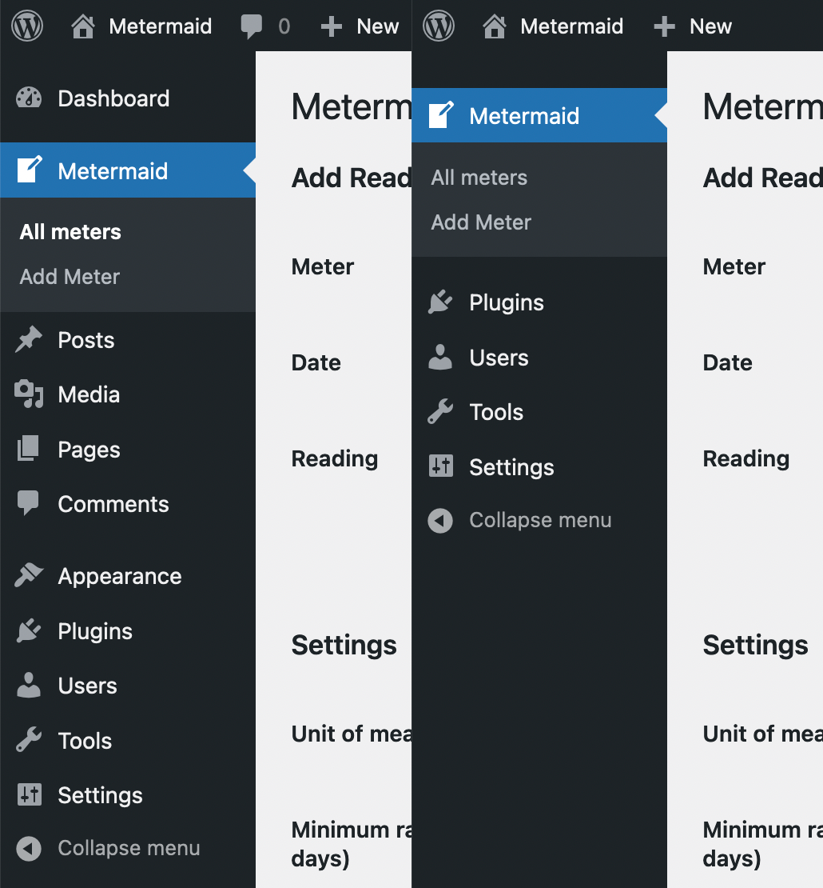

Not A Blog
----------
Not A Blog is a WordPress plugin to use when you're using WordPress solely as a CMS to power a custom plugin.

It disables the front-end (redirecting to a chosen wp-admin page) and removes the blogging menu items from wp-admin.

Before/After Not A Blog:



To define which page should be the default landing page, return the URL from the `not_a_blog_default_page` filter, like so:

```
add_filter( 'not_a_blog_default_page', function ( $url ) {
	return 'wp-admin/admin.php?page=my_custom_page';
} );
```